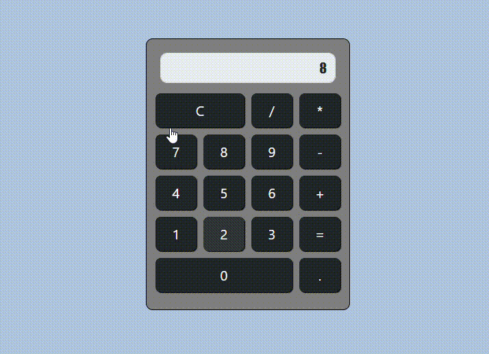

     <h1>Calculadora - Simples</h1>

## Data

    26/04/2024 , Fortaleza - CE

## Descrição

   É uma calculadora simples e intuitiva desenvolvida em JavaScript com HTML/CSS e Bootstrap, que oferece uma variedade de funções matemáticas básicas para ajudar você em seus cálculos do dia a dia.

## Funcionalidade
- Adição
- Substração
- Multiplicação
- Divisão

## Imagens do Projeto

## Autor
@KaueNunez

## Agradecimentos
- Jorge Sant Ana
- Curso : Desenvolvimento Web Completo - 20 cursos + 20 projetos
  

    <h1>KaueNunez - 👨🏻‍💻 + ☕ = < / ></h1>

